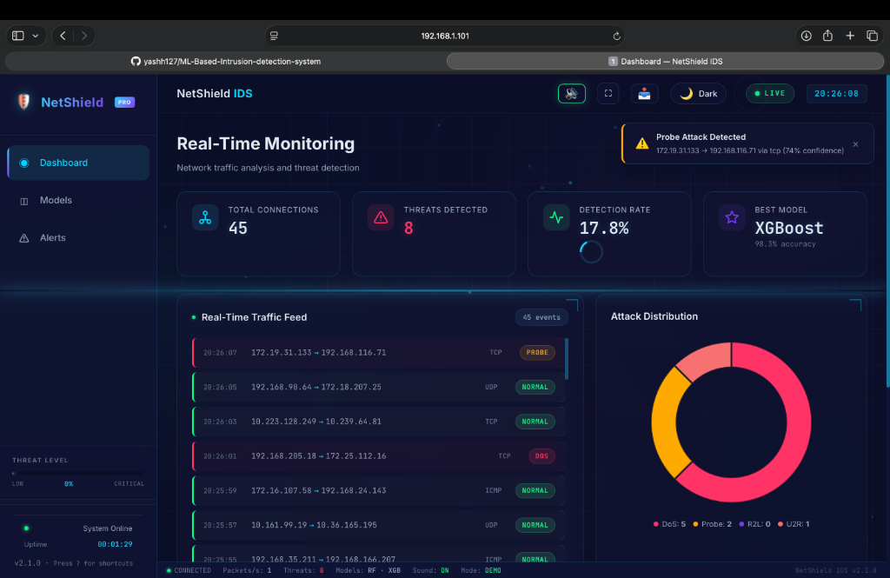
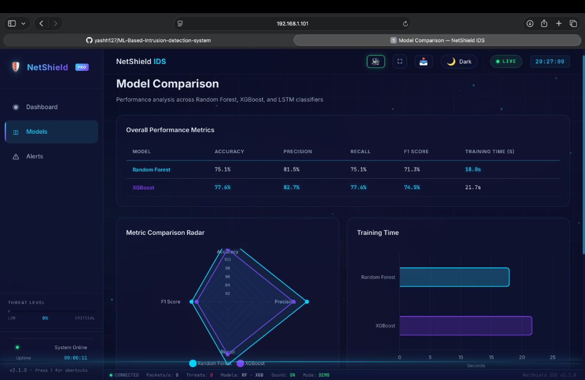
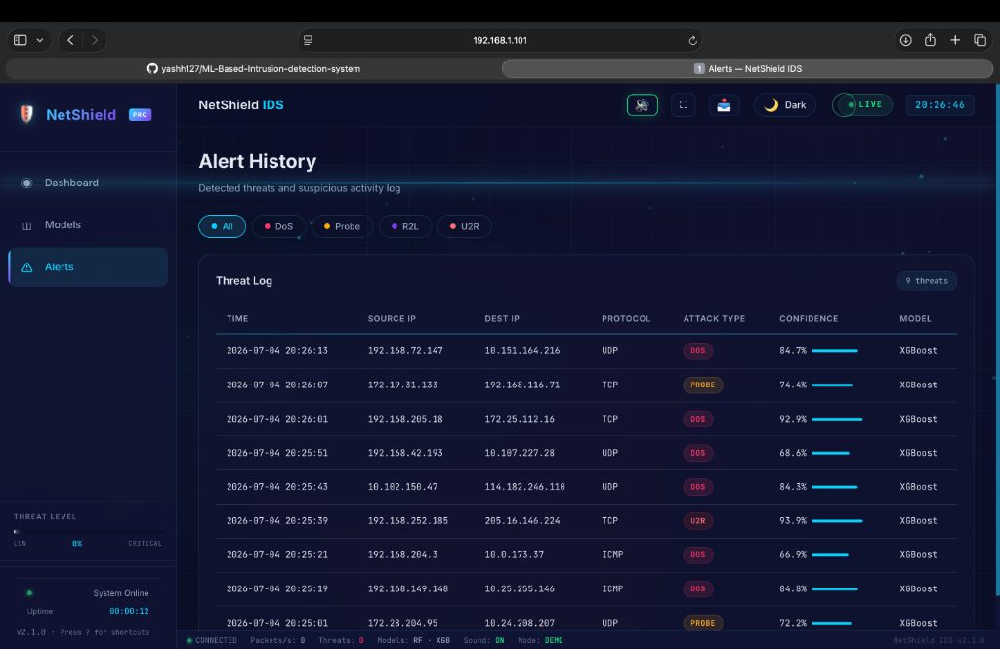

<div align="center">

# 🛡️ NetShield IDS

### Enterprise Machine Learning Network Intrusion Detection & Prevention System

An end-to-end, production-grade cybersecurity platform combining **Ensemble Machine Learning (Random Forest & XGBoost)** with real-time **Security Operations Center (SOC)** telemetry, Explainable AI (XAI), and automated firewall response.

[](https://python.org)
[](https://flask.palletsprojects.com)
[](https://xgboost.readthedocs.io)
[](https://scikit-learn.org)
[](https://www.chartjs.org)
[](LICENSE)

**[Key Capabilities](#-key-capabilities) · [System Architecture](#%EF%B8%8F-system-architecture) · [Model Performance](#-model-benchmarks) · [Quick Start](#-quick-start) · [Tech Stack](#-technology-stack)**

</div>

---

## 🎬 Platform Overview

### 📊 Real-Time SOC Monitoring & Threat Telemetry
> High-throughput live connection inspection, geographic threat visualization, and automated alert feeds.



### 🧠 Model Performance & Multi-Class Evaluation
> Comprehensive side-by-side benchmark radar charts and per-class classification metrics.



### 🚨 Threat Incident Log & Compliance History
> Filterable intrusion logs with sub-millisecond confidence scores, MITRE tactics, and CSV export.



---

## 🚀 Key Capabilities

### 🧠 1. Machine Learning & Threat Classification
* **5-Class Network Taxonomy**: Distinguishes **Normal** traffic from **DoS** (Denial of Service), **Probe** (Port/Network Scans), **R2L** (Unauthorized Remote Access), and **U2R** (User-to-Root Privilege Escalation).
* **Class Imbalance Resolution**: Utilizes **SMOTE (Synthetic Minority Over-sampling Technique)** to balance severe class disparities (e.g., handling 52 U2R instances vs 67,000+ Normal records).
* **Feature Engineering Pipeline**: Standardizes 122 categorical and continuous network flow attributes with One-Hot encoding and StandardScaler normalization.

### 🛡️ 2. Security Operations Center (SOC) & Automated Response
* **Active Firewall Quarantine (IPS)**: Instantly generates and enforces Linux `iptables` quarantine rules with one-click IP blocking.
* **Explainable AI (XAI)**: Decision transparency breakdown showing key anomaly factors, feature contributions, and SHAP anomaly scores for every flagged packet.
* **Live Global Threat Map**: Dynamic geographical attack origin tracking with animated vector arcs.
* **Interactive Attack Injection Sandbox**: On-demand attack crafting interface for live penetration testing and model validation.
* **Batch PCAP & Capture Analyzer**: Upload `.pcap`, `.pcapng`, or `.csv` files for high-throughput batch signature inspection.
* **Executive Incident Audit Reports**: One-click generation of formatted JSON/PDF incident compliance reports mapped against the **MITRE ATT&CK framework**.

---

## 📊 Model Benchmarks

Trained on the standard **NSL-KDD benchmark dataset** (125,973 training flows, 22,544 test flows with novel unseen zero-day attack variants):

| Model | Accuracy | Precision | Recall | F1-Score | Inference Latency |
|:------|:--------:|:---------:|:------:|:--------:|:-----------------:|
| **Random Forest** | 75.15% | 81.48% | 75.15% | 71.30% | ~0.94 ms |
| **XGBoost Classifier** ⭐ | **77.59%** | **82.69%** | **77.59%** | **74.46%** | **~1.18 ms** |

### Per-Class Detection Matrix (XGBoost)

| Threat Category | Precision | Recall | F1-Score | MITRE ATT&CK Tactic |
|:----------------|:---------:|:------:|:--------:|:-------------------|
| **Normal Traffic** | 67.6% | 97.2% | 79.8% | Baseline Network Operations |
| **DoS (Denial of Service)** | 96.4% | 79.0% | 86.9% | `T1498` — Network Denial of Service |
| **Probe (Reconnaissance)** | 84.7% | 69.2% | 76.2% | `T1595` — Active Scanning & Port Sweeps |
| **R2L (Remote to Local)** | 57.8% | 26.3% | 36.2% | `T1078` — Valid Accounts & Privilege Abuse |
| **U2R (User to Root)** | 42.6% | 10.1% | 16.3% | `T1068` — Exploitation for Privilege Escalation |

---

## 🏗️ System Architecture

```
┌─────────────────────────────────────────────────────────────────────────┐
│                           1. INGESTION & DATA LAYER                     │
│  Raw Packet Stream (Scapy) / NSL-KDD Captures / Uploaded PCAP Files     │
│  Feature Extraction (41 Network Attributes) → Scaling & SMOTE Balance   │
└────────────────────────────────────┬────────────────────────────────────┘
                                     │
┌────────────────────────────────────▼────────────────────────────────────┐
│                           2. INFERENCE ENGINE                           │
│     ┌────────────────────────┐          ┌─────────────────────────┐     │
│     │ Random Forest (200 T)  │          │  XGBoost Classifier     │     │
│     └───────────┬────────────┘          └────────────┬────────────┘     │
│                 └─────────────────┬──────────────────┘                  │
│                                   ▼                                     │
│              Multi-Class Attack Prediction & XAI Attribution            │
└───────────────────────────────────┬─────────────────────────────────────┘
                                    │
┌───────────────────────────────────▼─────────────────────────────────────┐
│                       3. SOC PRESENTATION & IPS LAYER                   │
│   Flask REST APIs & Server-Sent Events (SSE) Stream                     │
│   ┌─────────────────────┐  ┌─────────────────────┐  ┌────────────────┐  │
│   │ Real-Time Dashboard │  │  Global Threat Map  │  │ XAI Inspector  │  │
│   └─────────────────────┘  └─────────────────────┘  └────────────────┘  │
│   ┌─────────────────────┐  ┌─────────────────────┐  ┌────────────────┐  │
│   │ Firewall Quarantine │  │  Attack Sandbox     │  │ Audit Reports  │  │
│   └─────────────────────┘  └─────────────────────┘  └────────────────┘  │
└─────────────────────────────────────────────────────────────────────────┘
```

---

## 💻 Technology Stack

| Domain | Technologies Used |
|:-------|:-------------------|
| **Machine Learning** | XGBoost, Scikit-learn, Imbalanced-learn (SMOTE) |
| **Data Engineering** | Pandas, NumPy, Joblib |
| **Backend & APIs** | Python 3.10+, Flask, Server-Sent Events (SSE), Scapy |
| **Frontend & UI/UX** | JavaScript (ES6+), Chart.js 4.x, Web Audio API, CSS3 Glassmorphism |
| **Security Standards** | MITRE ATT&CK Framework, Linux IPTables Automation |

---

## 🚀 Quick Start

### 1. Clone & Environment Setup
```bash
git clone https://github.com/yashh127/ML-Based-Intrusion-detection-system.git
cd ML-Based-Intrusion-detection-system

python3 -m venv venv
source venv/bin/activate       # On Windows: venv\Scripts\activate
pip install -r requirements.txt
```

### 2. Launch Platform
```bash
python run.py --demo --port 5050
```
Open **`http://localhost:5050`** in your browser.

---

## 📝 License

Distributed under the **MIT License**. See `LICENSE` for more information.

<div align="center">

**Developed by [Yash](https://github.com/yashh127)**

</div>
